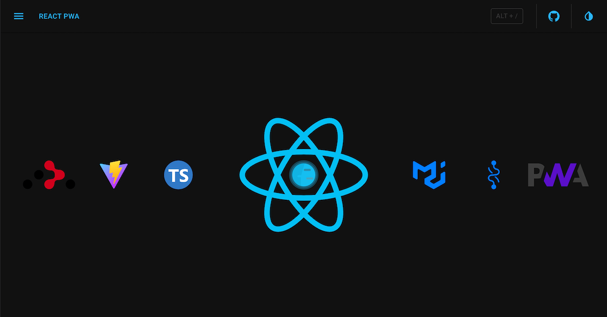
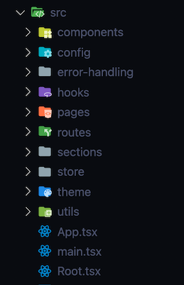
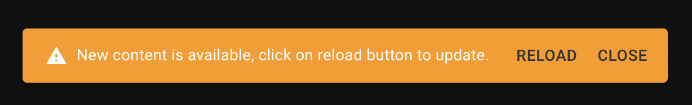
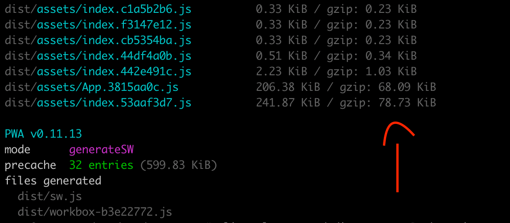
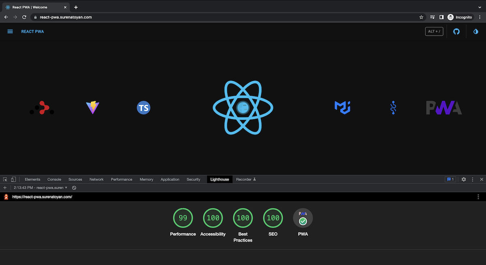
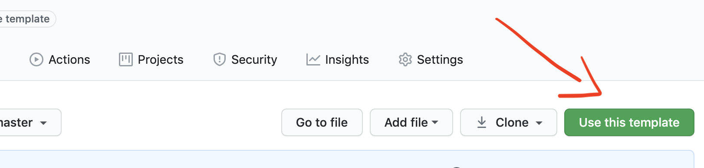
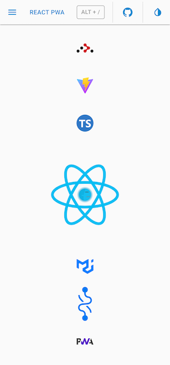

[](https://github.com/suren-atoyan/react-pwa/actions/workflows/analyses.yml)
[](https://github.com/suren-atoyan/react-pwa/actions/workflows/tests:e2e.yml)

<a href="http://react-pwa.surenatoyan.com/" target="_blank" rel="noreferrer">
 
</a>

# React-PWA - `v2` is here 🚀🎉⚡️

**Starter kit for modern web applications!**

## Synopsis

This project (a GitHub template) is an opinionated setup for modern web applications.
It's a combination of essential (and minimal) libraries/components/utils/dev-tools/etc., which developers usually need during the process of making modern React applications.

## Motivation

Almost all projects need to have a router, a UI framework, store integration, theming, error handling, base file/folder structure, a builder, some developer tools (eslint, prettier, etc), tests and many more. In this starter kit, we tried to put together the best options available from the above-mentioned fields. Out of the box, it provides a modern production-ready setup created by developers for developers 💚

### Tech stack

- ✅ [Vite](#vite)
  - `v5` 🔥
- ✅ [React](#react)
  - `v18` 🔥
- ✅ [TypeScript](#typescript)
- ✅ [UI-framework](#ui-framework)
  - `MUI v5`

### Core features

- ✅ [Router](#router)
  - `React Router v6`
- ✅ [Store](#store)
  - `Recoil`
- ✅ [Notifications](#notifications)
- ✅ [Theme](#theme)
- ✅ [Base file/folder structure](#base-filefolder-structure)
- ✅ [PWA](#pwa)
- ✅ [Performance](#performance)
- ✅ [Hotkeys](#hotkeys)
- ✅ [Error Handling](#error-handling)
- ✅ [Pages](#pages)

### Dev tools and tests

- ✅ [Tests](#tests) 🚀
  - [unit tests](#unit-tests) - `Vitest`
  - [e2e tests](#e2e-tests) - `Playwright`
- ✅ [GitHub Actions](#tests)
- ✅ [Environmental variables](#environmental-variables)
- ✅ [EsLint](#eslint)
- ✅ [Prettier](#prettier)
- ✅ [Husky](#husky)
- ✅ [Lint staged](#lint-staged)
- ✅ [https localhost](#https-localhost)

#### Vite

[Vite](https://vitejs.dev/) is a blazingly fast build tool based on [native ES modules](https://hacks.mozilla.org/2018/03/es-modules-a-cartoon-deep-dive/), [rollup](https://rollupjs.org/guide/en/), and [esbuild](https://esbuild.github.io/). It provides a great developer experience and super fast builds.

#### React

The latest version (v18) is used here. All dependencies support [React](https://reactjs.org/) v18 and the `v2` is refactored according to the latest changes and requirements of `React` v18.

#### TypeScript

"Not using [TypeScript](https://www.typescriptlang.org/) is like driving without a seatbelt" - [Matt Howard](https://twitter.com/MattDotHow).

For those who are not familiar with `TypeScript` - don't worry, you will love it, as we all did. `TypeScript` is a superset of `JavaScript`; it should be very easy to work with if you know `JavaScript`.

#### Router

[React Router v6](https://reactrouter.com/) is used here. You can find routing in the [src/routes](./src/routes/) folder.

#### UI-framework

[MUI](https://mui.com/) v5 is used here. `MUI` is a fully-loaded component library, super customizable, and easy to use.

#### Store

As a store management tool [Recoil](https://recoiljs.org/) is used. Check the [src/store](./src/store) folder for more information.

#### Notifications

Out of the box you have a notification system. To show a simple notification you can use `useNotification` hook:

```js
import { useNotifications } from '@/store/notifications';

function MyCoolComponent() {
  const [notifications, actions] = useNotification();

  function showNotification() {
    actions.push({ message: 'Բարև, կարմի՛ր արև' });
  }

  return (
    ...
  );
}

```

#### Theme

The [theme system](./src/theme/) is based on [MUI Theme](https://mui.com/material-ui/customization/theming/#main-content). To get the current theme mode or to change it you can use `useTheme` hook:

```js
...
import { useTheme } from '@/store/theme';

function MyCoolComponent() {
  const [theme, actions] = useTheme();

  // check the current theme mode
  console.log(theme);

  // if you want to change the theme, call an appropriate action
  function toggleTheme() {
    actions.toggle();
  }

  ...
}
```

You have access to `theme` object via `sx` prop and `styled-components`:

```js
import Box from '@mui/material/Box';
import Button from '@mui/material/Button';
import { styled } from '@mui/material/styles';

// styled-components
const MyCoolButton = styled(Button)(({ theme }) => ({
  marginRight: theme.spacing(1),
  color: theme.palette.text.disabled,
}));

// sx prop
function MyCoolComponent() {
  return <Box sx={{ borderRadius: theme.shape.borderRadius }}>...</Box>;
}
```

Also, you can redefine the theme in the theme configuration file. Check the [src/theme/themes.ts](./src/theme/themes.ts) file for more information.

#### Base file/folder structure

Here how the base file/folder structure looks like:



Special attention deserves `pages/`, `sections/` and `components/`. These are the main building blocks of the application and here is the difference between them:

- `components` - usually (but not necessarily), in `components/` we keep dummy, stateless components, that are being used in different parts of the application, and they don't belong to the particular page/section, like `Button`, `List`, `Table`, `Loading`, `Divider`, `Flex`, `Dialog`, etc.
- `sections` - sections are complete parts of the application, that have their own logic, like `Navigation`, `Sidebar`, `Notifications`, etc.
- `pages` - pages represent the root routes, like `/profile` renders the `Profile` page, `/login` renders `Login` page. Pages are made of sections (no need to have [Page]/sections/ folder). If a section is used on multiple pages it should be moved to `/root/sections`.
  - in some project you may see `/features` instead of `/sections`

Another important mention is any component's folder structure. It should look like this:

```
- [Component]
  - index.ts
  - [Component].tsx
  - types.ts
  - styled.ts
  - utils.tsx
  - etc.
```

It's a good practice to keep all related files in one folder. It makes it easier to find and maintain them. Only the first two files are required. You may or may not have component-related types, styles, utils, etc. But if you have them, keep them in the same folder and separate files. Let's see what each file is responsible for:

- `index.ts` - this is the entry file for the component. It `export default`s the "original" version of the component. It may also export other variations of the component, like `memo()`, `lazy()`, `withSomething()` (any HOC), `loading/error` `Suspense` wrapper if you use `React` cuncarrent mode
- `[Component].tsx` - this should contain only the component in its pure form, no HOCs, no other wrappers, no types, no styles, no utilities, etc.
- `types.ts` - contains any type definitions related to the component
- `styled.ts` - contains styled-components (that's why it's styled.ts no styles.ts), may contain also other style-related properties, like constants (DIALOG_MAX_WIDTH or something), etc. Check this [example](./src/sections/Header/styled.ts)

#### PWA

Out of the box, it's a `Progressive Web Application`. It can be installed on mobile and desktop devices 🙂, it can work offline, and many more. Check more about PWAs [here](https://web.dev/progressive-web-apps/)

Your users will also be informed about the new version of your app:



#### Performance

After all these integrations the biggest bundle size is `~79KB`. It means even the first load will be pretty fast (in my case it's `1.1s`), further loads (already cached by `service worker` and `workbox`) will take `~0.25s`.





NOTE: The performance is not 100 because it's running on demo server.

#### Hotkeys

A basic implementation of hotkeys is demonstrated here. Check the [src/sections/HotKeys](./src/sections/HotKeys/HotKeys.tsx) for more information.

Currently, you can use the following hotkeys:

`Alt+s` - to toggle the theme mode
`Alt+t` - to toggle the sidebar
`Alt+/` - to open the hotkeys dialog

#### Error Handling

Nobody likes white screens and crashes without any notes. In [src/error-handling](./src/error-handling) you can find the error handling implementation. Here you can find `withErrorHandler` high order component. You can wrap any component by this HOC and it will catch all errors and show a default or your custom fallback. Currently, the main APP component is wrapped by `withErrorHandler` HOC.

#### Pages

From a layout point of view the application consists of 3 main parts:

- Header
- Sidebar
- Pages

The last one is a router-based switcher. All routes are defined in [src/routes](./src/routes/index.ts). By default, pages are being loaded asynchronously via [asyncComponentLoader](src/utils/loader/loader.tsx). You can use it to asynchronously load any `React` component you want. It uses `React.Suspense` and `React.lazy` with some magic 🧙‍♂️

#### Tests

Tests are a vital part of any project. Sometimes they are boring, sometimes they are hard to write, but they are very important. This setup tries to make the testing process as easy as possible. It contains:

- unit tests
- e2e tests

##### Unit tests

[Vitest](https://vitest.dev/) is used here for unit tests. Check [src/insertIf/insertIf.spec.ts](./src/insertIf/insertIf.spec.ts) for an example. You can run unit tests by running:

```bash
npm run test:unit # or yarn test:unit
```

##### E2E tests

[Playwright](https://playwright.dev/) is used for e2e tests. Check [e2e/](./e2e/) folder to see examples. You can run e2e tests by running:

```bash
npm run test:e2e # or yarn test:e2e
```

If you want to run e2e tests in UI mode, run:

```bash
npm run test:e2e:ui # or yarn test:e2e:ui
```

[playwright.config.ts](./playwright.config.ts) contains the configuration for e2e tests. Currently, it's configured to run tests in `chromium`, `firefox` and `webkit` browsers. You can add more browsers if you want.

#### GitHub Actions

There are 2 GitHub Actions workflows:

- [analyses.yml](./.github/workflows/analyses.yml) - runs `prettier`, `eslint`, `ts` checks and unit tests on every push and pull request to `main/master` branch.
- [tests:e2e.yml](./.github/workflows/tests:e2e.yml) - runs e2e tests on every push and pull request to `main/master` branch.

#### Environmental variables

Put your environmental variables in the `.env` file (they should be prefixed with `VITE_`) and use them in your code via `import.meta.env.[variable_name]` syntax. `.env` file is not committed to the repository (it's under `.gitignore`), but `env/.shared` is. You can use it as a template. Usually, you will have different `.env` files for different environments (dev, staging, production, etc.), like:

- `env/.shared` - shared variables
- `env/.dev` - dev variables
- `env/.staging` - staging variables
- `env/.production` - production variables

Copy the content of `env/.[template_name]` to `.env` file and fill it with your variables. Note: `env/.shared` is being copied to `.env` file automatically after `npm install`.

#### EsLint

The latest version of [eslint](https://eslint.org/) with the latest recommended collection of `eslint` rules is available out of the box. It contains:

- eslint:recommended
- react/recommended
- @typescript-eslint/recommended

Check the [.eslintrc.json](./eslintrc.json) file for more information.

#### Prettier

[prettier](https://prettier.io/) - stop fighting about styling in code reviews; save your time and energy - configure it once and let the machine format/correct your code.

Check the [.prettierrc.json](./prettierrc.json) file for more information.

There is an additional configuration for your import statements. They will be automatically ordered and grouped by the given rules (check the `.prettierrc.js`) - one more topic for debates in code reviews :)

#### Husky

You can use [husky](https://typicode.github.io/husky/#/) to lint your commit messages, run tests, lint code, etc.

Currently, only `pre-commit` hook is set up. Every time you try to do a commit it will run `prettier` and `eslint` to be sure that everything is according to the rules.

#### Lint-staged

[lint-staged](https://github.com/okonet/lint-staged) helps to run `eslint` and `prettier` only on staged files - it makes the linting process super fast and sensible.

#### https localhost

[https localhost](https://github.com/daquinoaldo/https-localhost) is a simple way to run your application on localhost with https.

Just run:

```bash
npm run https-preview # or yarn https-preview
```

after:

```bash
npm run build # or yarn build
```

and check `https://localhost` in your browser.

NOTE: the first time it will ask you about installing localhost certificate. For more info check [this](https://github.com/daquinoaldo/https-localhost#root-required)

## Usage

You can use this template by just pressing `Use this template`.



Or you can fork/clone it.

Install dependencies:

```bash
npm install # or yarn
```

In order to run it in development, run:

```bash
npm run dev # or yarn dev
```

In order to do a production build, run:

```bash
npm run build # yarn build
```

There are other scripts as well:

- `prettier:check` - check if all files are formatted according to the rules.
- `lint:check` - check if all files are linted according to the rules.
- `ts:check` - check if all files are typed according to the rules.
- `test:unit` - run unit tests.
- `test:e2e` - run e2e tests.
- `test:e2e:ui` - run e2e tests in UI mode.
- `preview` - boot up local static web server that serves the files from `dist` folder. It's an easy way to check if the production build looks OK in your local environment.
- `https-preview` - is the same as `preview`, but with HTTPS. It's handy for testing your PWA capabilities in your local environment.
- `prepare` - install `husky` and copy the default `env/.shared` file to `.env` file. This script is being run automatically after `npm install` or `yarn`.

## [Live Demo](https://react-pwa.surenatoyan.com/)

<div>
  
</div>

## License

[MIT](./LICENSE)
