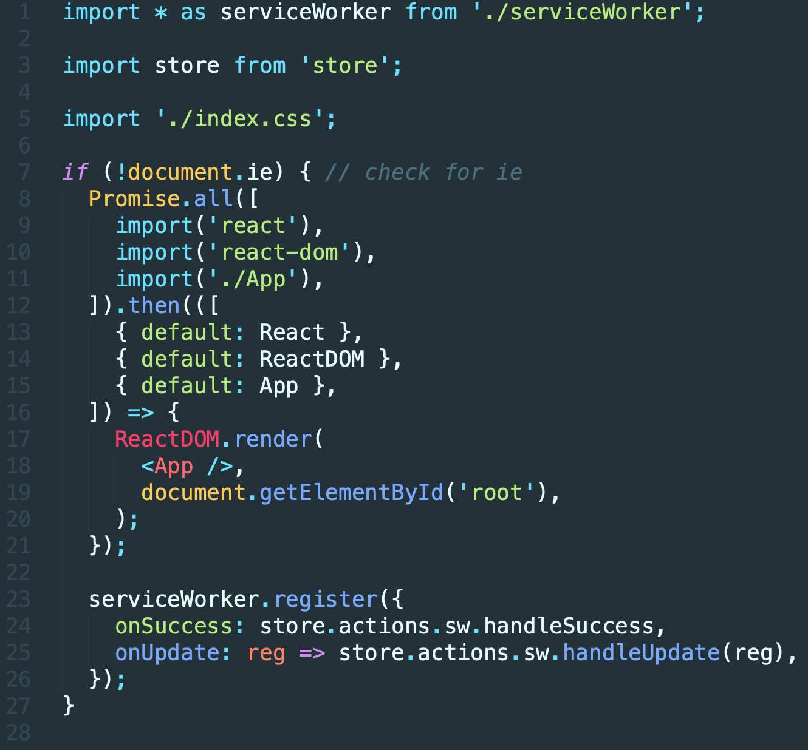
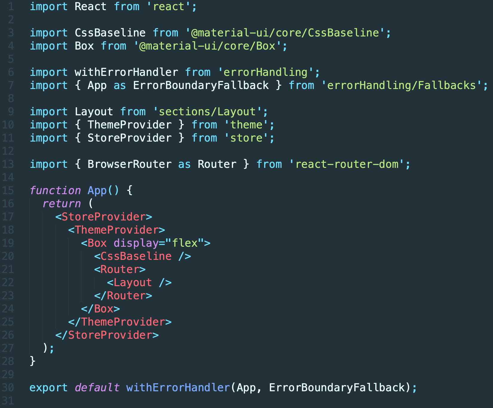
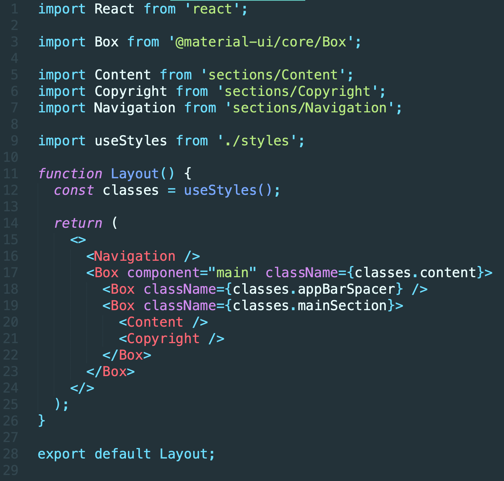
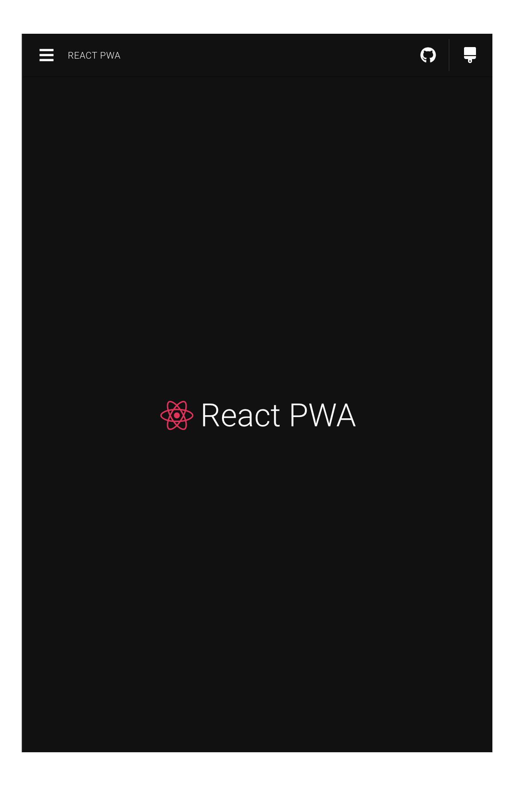
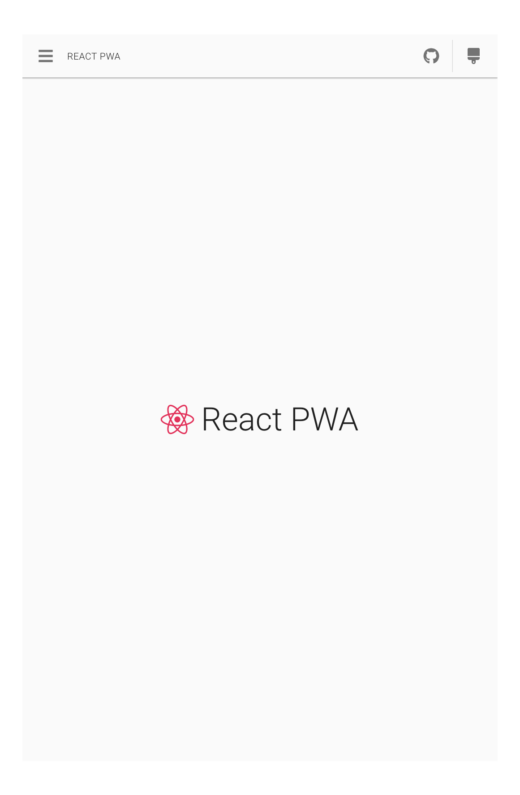

# React-PWA

A minimal React PWA application as a Github template.

## Synopsis

It's a combination of essential (and minimal) libraries/components/utils and their integrations upon CRA, which developers usually need during making React application.

## Motivation
We love CRA. And we think it's the right way to build a React application for most of the projects. We have been using CRA in lots of projects, and we are sure that there are lots of routines that developers don't need to care about: like webpack config.

By the same philosophy, there are other routines above the basic configuration, which are almost the same in lots of projects - like router, theme, store, etc. This project is a minimal layer upon CRA which gives you all of that out of the box as a template.

## Features

#### CRA

It's based on CRA, which is (of course) not ejected. It means you have full access to CRA features.

#### React Router

The latest version of `react-router-dom` is integrated. Routes are defined in [/src/routes/](https://github.com/suren-atoyan/react-pwa/blob/master/src/routes/index.js). In the minimal version of the template, there are demonstrated 5 routes that render 5 pages. Pages are loaded asynchronously by [AsyncComponentLoader](https://github.com/suren-atoyan/react-pwa/blob/master/src/components/AsyncComponentLoader/Component.js) component (which is optional).

#### Material-UI

The latest version of `Material-UI` is integrated. The whole layout of the application is made by `Material-UI` components. In the demonstrated components/sections you can notice how MUI components can be customized. The styling system is also inherited from MUI.

#### Theme

The [theme system](https://github.com/suren-atoyan/react-pwa/blob/master/src/theme/ThemeProvider.js) is based on MUI theme. There are two themes' styles that are defined in the [config file](https://github.com/suren-atoyan/react-pwa/blob/master/src/config/index.js). The theme provider, which is based on MUI is integrated with app and store.

#### Error Handling

[Error Handling](https://github.com/suren-atoyan/react-pwa/tree/master/src/errorHandling) is based on `react-error-boundary` package. There is also [implemented](https://github.com/suren-atoyan/react-pwa/tree/master/src/errorHandling/Fallbacks) a general fallback for the whole app.

#### Store

For store management here is used `overmind`. It's a simple store management tool. See the [implementation and integration](https://github.com/suren-atoyan/react-pwa/tree/master/src/store) of it in this project.

#### Service Worker

In the production application will be used service worker and workbox provided by CRA, plus we "listen" to changes, and in case of new build, the user will get a notification about the new version of the application (app is updatable).

#### SEO

For SEO there is used `react-helmet`. The [Meta component](https://github.com/suren-atoyan/react-pwa/tree/master/src/components/Meta) will help you to update meta tags easily. To see the simple usage of it check [this](https://github.com/suren-atoyan/react-pwa/blob/master/src/pages/Welcome/Component.js#L20).

#### No IE

A special script works in the index.html file for checking if the browser of the user is any version of IE or not. And if it is, the execution of the application is being stopped and a special message will be shown. You may not think about the compatibility of the app and IE, plus you may not think about how broken your app will be in different versions of IE. So, all users of IE will see this message when they visit your app.

You can see the implementation of this [here](https://github.com/suren-atoyan/react-pwa/tree/master/public/ie). It supports multiple languages. You can add your language with it's translation [here](https://github.com/suren-atoyan/react-pwa/blob/master/public/ie/init.js#L15).

#### Structure

`index.js`

`App.js`

`Layout`

## Demo

  

